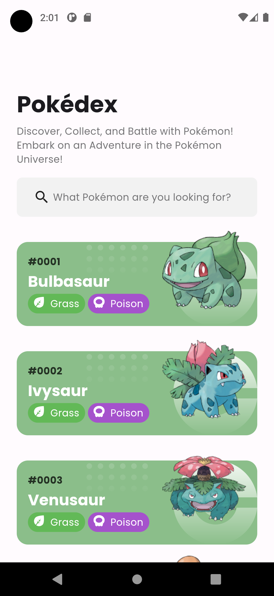
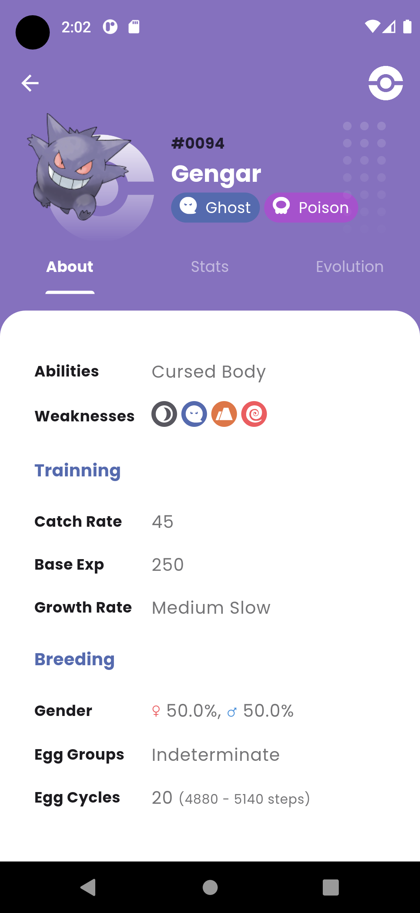
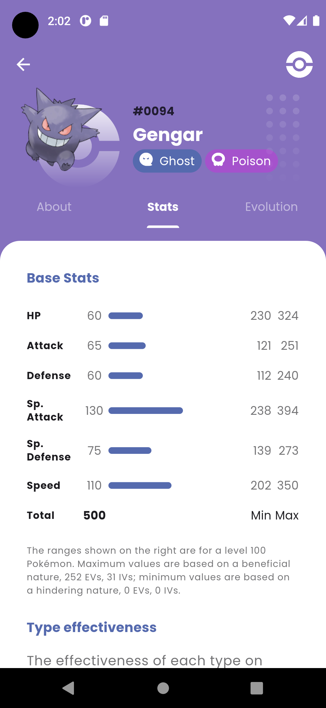
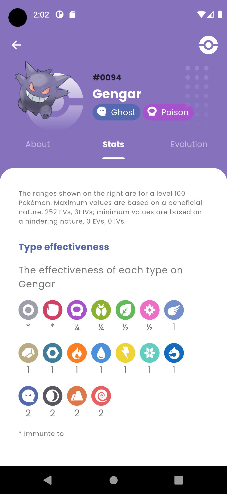
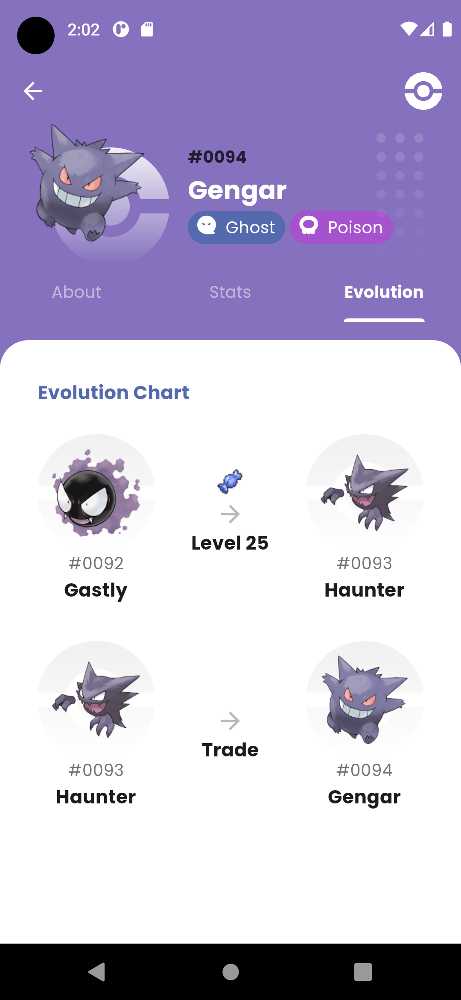

# GitHub Pokédex Project

> Note: I recommend to run this project in mobile platforms: Android and iOS.

Welcome to the GitHub Pokédex project! This comprehensive Pokédex allows you to explore and discover information about your favorite Pokémon from all generations.

## Showcase

  
  
  

  
  
  

  

## Features

- **Pagination**: Browse through a vast collection of Pokémon with smooth and seamless pagination.

- **Search by Name**: Easily find specific Pokémon by entering their name in the search bar.

- **View Status**: Get detailed information about a Pokémon's attributes, including HP, Attack, Defense, Special Attack, Special Defense, and Speed.

- **View Description**: Learn more about a Pokémon through captivating descriptions.

- **Evolution Chain**: Follow the evolution journey of each Pokémon to see their different forms and stages.

## Data Source

All Pokémon information in this Pokédex is sourced from [PokeAPI](https://pokeapi.co/), the ultimate Pokémon API that provides a wealth of data about Pokémon species, abilities, moves, types, and much more.

## Technologies Used

- Flutter: A powerful and flexible framework for building cross-platform mobile applications.

- Dart: The programming language used for building applications in Flutter.

## Flutter Libraries Used

Some used libraries:

- [GetIt](https://pub.dev/packages/get_it): A simple service locator for dependency injection.

- [Injectable](https://pub.dev/packages/injectable): A convenient and flexible way to manage dependency injection.

- [Bloc](https://pub.dev/packages/flutter_bloc): A state management library for building reactive UI components.

- [GoRouter](https://pub.dev/packages/go_router): A declarative router for Flutter that simplifies navigation.

- [Flutter Animate](https://pub.dev/packages/flutter_animate): A library for creating stunning animations in Flutter.

- [Cached Network Image](https://pub.dev/packages/cached_network_image): A library for caching and displaying network images with ease.

- [Google Fonts - Poppins](https://fonts.google.com/specimen/Poppins): A delightful typeface used for beautiful typography in the app.

- [Pokedex](https://pub.dev/packages/pokedex): Pokeapi wrapper.

## Credits

If I accidentally missed someone, sincerely apologize.

- [Pokémon © Nintendo/Creatures Inc./GAME FREAK Inc](https://www.pokemon.com/us): Offical producer.

- [PokeAPI](https://pokeapi.co/): A comprehensive Pokémon API that provides data on various aspects of Pokémon.

- [Flavio Farias](https://www.figma.com/file/THLxZSlOoUYMZrjFg0Kl1M/Pok%C3%A9dex?type=design&node-id=18241-2789&mode=design&t=loSHVWpRZJb59w6i-0): For the inspiring Pokédex design on Figma.

- [Bulbapedia](https://bulbapedia.bulbagarden.net/): A valuable resource for Pokémon information, moves, abilities, and much more.

## Acknowledgements

Special thanks to the Pokémon community for their continued passion and love for these amazing creatures. Together, we're creating a one-of-a-kind Pokémon experience!

Happy exploring, Trainers! 🌟

## License
This project is licensed under the [MIT License](https://opensource.org/license/mit/). Feel free to use, modify, and distribute the code as per the terms of the license.

By adding the MIT License to the footer, you're granting users the freedom to use, modify, and distribute your code while also providing them with legal protections. If there's anything else you'd like to include or modify, please let me know!
