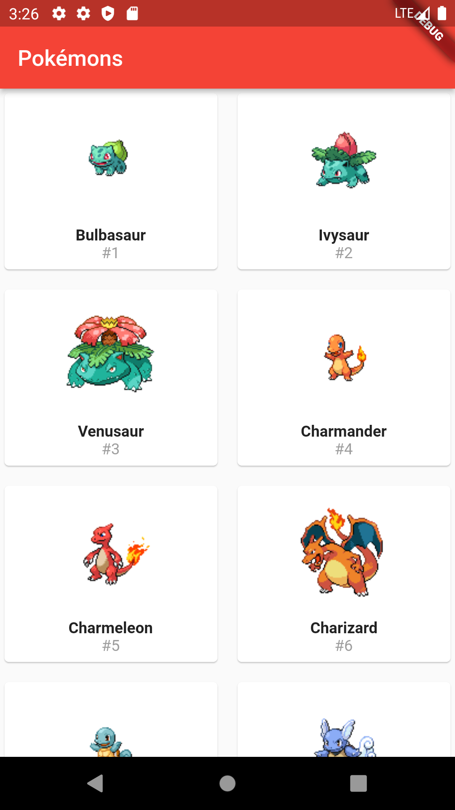

# pokedex-flutter

A Poc project to validate Flutter concepts using [Pokedex API](https://pokeapi.co/). This project works on Android and iOS Platform by pagging Pokedex API and show us all Pokémons.

## Architecture

Basically the project structure is using [The Clean Architecture](https://blog.cleancoder.com/uncle-bob/2012/08/13/the-clean-architecture.html), our layers are: **data**, **domain** and **presentation**.

* **data**: Services (API requests), Data Access Object (DAO), repository (data provider), etc.
* **domain**: Responsible for getting data from repository providers.
* **presentation**: Page (screens).

## Tools and libraries

* **[dio](https://pub.dev/packages/dio)**: Http client, which supports Interceptors, File download etc.
* **[injectable](https://pub.dev/packages/injectable)**: Powerful for Dependency Injection (D.I). Supports: fabric methods, auto D.I using files and packages structure, environmets etc.
* **[get-id](https://pub.dev/packages/get_it)**: Service locator to avoid boilerplate in same cases to reuse D.I.
* **[json_serializable](https://pub.dev/packages/json_serializable)**: Build System to generate classes from json pattern.
* **[chuck_flutter](https://pub.dev/packages/chucker_flutter)**: Interceptor to log http/s requests in mobile devices (Android and iOS Platforms).
* **[drift](https://pub.dev/packages/drift)**: Amazing library to provides database communication using Sqlite3. Supports drift files to create database structure.
* **[mockito](https://pub.dev/packages/mockito)**: Mock library for Dart (supports build runner too).

## Show case

    

    

